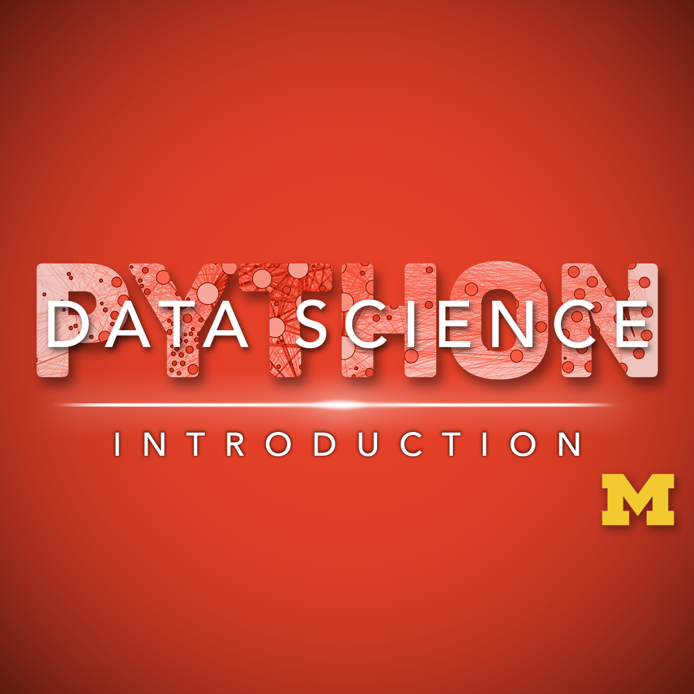

# Introduction to Data Science in Python

[Course Link](https://www.coursera.org/learn/python-data-analysis?specialization=data-science-python)

This course will introduce the learner to the basics of the python programming environment, including fundamental python programming techniques such as lambdas, reading and manipulating csv files, and the numpy library. The course will introduce data manipulation and cleaning techniques using the popular python pandas data science library and introduce the abstraction of the Series and DataFrame as the central data structures for data analysis, along with tutorials on how to use functions such as groupby, merge, and pivot tables effectively. By the end of this course, students will be able to take tabular data, clean it, manipulate it, and run basic inferential statistical analyses. 

**SKILLS YOU WILL GAIN** :
1. Python Programming
2. Numpy
3. Pandas
4. Data Cleansing